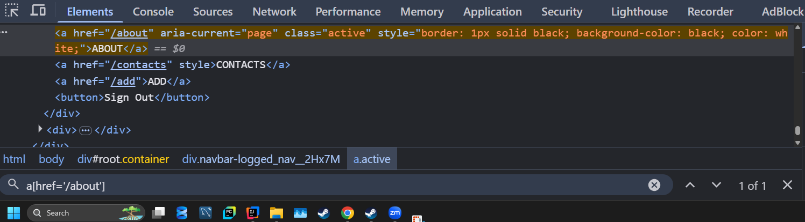
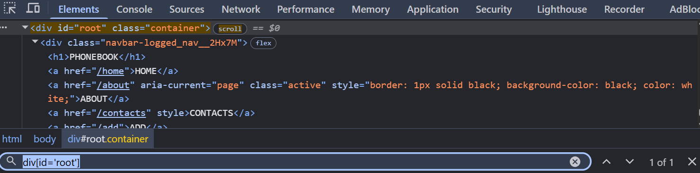
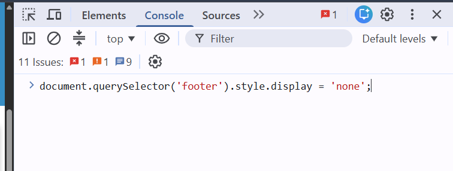

# Lesson 1. Css Selectors
### Prepare test environment: [build.gradle](/build.gradle/)
```java
plugins {
    id 'java'
}

group = 'org.example'
version = '1.0-SNAPSHOT'

repositories {
    mavenCentral()
}

dependencies {
    implementation 'org.seleniumhq.selenium:selenium-java:4.26.0'
    implementation 'org.testng:testng:7.11.0'
}

test {
    useTestNG()
}
```
### Create instance of ChromeDriver
````java 
WebDriver driver = new ChromeDriver();
````
### Pause
```java
public void pause(int time) {
        try {
            Thread.sleep(time);
        } catch (InterruptedException e) {
            throw new RuntimeException(e);
        }
    }
```
### Scrolling page
```java
public void scrollActions(){
        Actions actions = new Actions(driver);
        for (int i = 0; i < 5; i++) {
            actions.scrollByAmount(0, 700).perform();
            try {
                Thread.sleep(500);
            } catch (InterruptedException e) {
                throw new RuntimeException(e);
            }
        }
    }
```
### Create Test
```java
@Test
    public void firstTest() {
    
    }
```
## Main commands
### 1. `pageLoadTimeout()`
* За что отвечает: Ограничивает время, которое браузер может потратить на открытие ссылки при вызове команд `driver.get()` или `driver.navigate().to()`.
* Как работает: Если страница полностью загрузилась (сработал триггер `document.readyState === 'complete'`) за 4 секунды, код сразу пойдет дальше. Если страница грузится слишком долго и 10 секунд истекли, Selenium прервет операцию и выбросит исключение `TimeoutException`.
* Зачем нужен: Чтобы тесты не зависали бесконечно на «битых» или крайне медленных страницах.

### 2. `implicitlyWait()`
- **За что отвечает**: Задает запас времени на поиск элементов через `driver.findElement()` или `driver.findElements()`.
- **Как работает**: Если элемент присутствует в DOM-дереве сразу, Selenium взаимодействует с ним мгновенно (ожидания нет). Если элемента нет, драйвер не выдает ошибку сразу, а начинает регулярно опрашивать (делать запросы к DOM) страницу в течение указанных 10 секунд. Если за 10 секунд элемент так и не появился, выбрасывается исключение `NoSuchElementException`.
- **Зачем нужен**: Помогает обрабатывать динамический контент (например, когда элементы подгружаются через AJAX не сразу). Конфигурация применяется один раз и действует на протяжении всего сокет-соединения (сессии) для каждого последующего поиска элемента.


### 3. Maximize browser window
```java 
driver.manage().window().maximize();
```
### 4. Get link
````java
driver.get("URL")
````
### 5. Navigation
```java
driver.navigate().to("https://telranedu.web.app/home");
driver.navigate().back();
driver.navigate().forward();
driver.navigate().refresh();
```
### 6. Find new WebElement by the CssSelector
```java
WebElement btnAbout =
                driver.findElement(By.cssSelector("a[href='/about']"));
WebElement btnHome =
                driver.findElement(By.cssSelector("[href='/home']"));
WebElement divRoot =
                driver.findElement(By.cssSelector("div[id='root']"));

// #root
// [id='root']
// *[id='root']

WebElement linkSearch =
                driver.findElement(By.cssSelector(".navigation-link"));
// точки для поиска по классам, найдет первый попавшийся
// a[class='navigation-link']
// .navigation-link
// *[class='navigation-link']
// a[id='0']
// #0
// a#0.navigation-link
// a#0.navigation-link[href='/search']

WebElement linkTerms = 
                driver.findElement(By.cssSelector
                        ("a.navigation-link[href='/terms-of-use']"));
// [href='/terms-of-use']
// a[href*='/of-use'] * -> включает в себя
// a[href^='/terms'] ^ -> начинается с...
// a[href$='-use'] $ -> заканчивается на...

WebElement linkSignUp = driver.findElement(By.cssSelector
                ("div.header a.navigation-link:nth-child(5)"));
// a:first-child
// a:last-child

// button submit Registration via button:nth-of-type
WebElement btnSubmitReg = driver.findElement(By.cssSelector
        ("div.login_login__3EHKB form button:nth-of-type(2)"));
// first-of-type
```


### 7. Find new WebElement by ID
```java
WebElement divRoot1 =
                driver.findElement(By.id("root"));
```
### 8. Find new WebElement by Name
```java
WebElement divRoot2 =
                driver.findElement(By.className("container"));
```
### 9. Find new WebElement by Text
```java
WebElement linkLetTheCar = 
                driver.findElement(By.linkText("Let the car work"));
WebElement linkLetTheCar1 = 
                driver.findElement(By.partialLinkText("work"));
```
### 10. JavaScript Executor. Hide footer
```java
public void hideFooter(){
        JavascriptExecutor js = (JavascriptExecutor) driver;
        js.executeScript("document.querySelector('footer').style.display = 'none'");
    }
```
